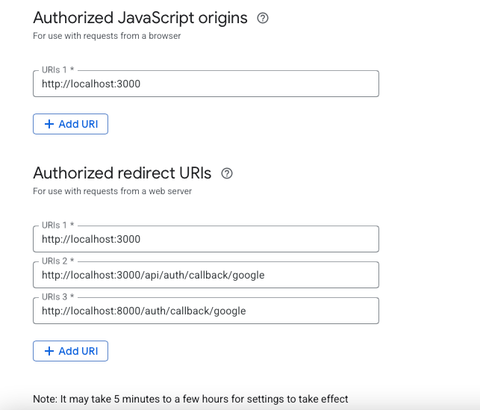

# Installation Guide

To run the project locally, you need to have Git and Docker Engine installed

**Prerequisites**:
```
Git
Docker
```

For macOS and Windows, you need to start Docker Desktop

**Clone the backend**:
```
Git clone https://github.com/IMTEL/RAGdoll.git
```
**Clone the frontends**:
```
Git clone https://github.com/IMTEL/RAGdollConfig.git
```
```
Git clone https://github.com/IMTEL/RAGdollChat.git
```
**Configuring environment variables**:

To run the system, you need to configure it with environment variables.

All the required environment variables are documented in RAGdoll/.env.example and RAGdollConfig/.env.development. You have to create your own .env file in RAGdoll by copying the .env.example file at the same place where the .env.example file is.

Your **RAGdoll/.env** file should look like this:

```env
ENV = 'dev'

# API URLs for frontend
RAGDOLL_CONFIG_API_URL = 'http://localhost:3000' 
RAGDOLL_CHAT_API_URL = 'http://localhost:3001'

# Database Configuration
MONGODB_URI=”SECRET”

# Database and Collections
MONGODB_DATABASE='database'
MONGODB_AGENT_COLLECTION='agents'
MONGODB_CONTEXT_COLLECTION='contexts'
MONGODB_DOCUMENTS_COLLECTION='documents'
RAG_DATABASE_SYSTEM='mongodb'


# Testing/Mock database settings
MOCK_RAG_DATABASE_SYSTEM = 'mongodb' 
MOCK_MONGODB_URI=”SECRET”
MOCK_MONGODB_DATABASE='test_database'

# AccessService, handles access keys, authorizes use of agents
ACCESS_SERVICE = 'service'
AUTH_SERVICE = ‘service’

# For encrypting api keys
FERNET_KEY=”SECRET”

# For authentication
SESSION_JWT_TOKEN_SECRET="SECRET" 

GOOGLE_CLIENT_ID="SECRET" 
GOOGLE_CLIENT_SECRET="SECRET"
```

**Secrets** for RAGdoll/.env:
To get your mongodb database you need to go to https://account.mongodb.com/account/login and then create your cluster. After creating your cluster you need to connect to your cluster using Drivers. Select Python as a Driver and copy your connection string. Paste your connection string into SECRET for MONGODB_URI and MOCK_MONGODB_URI.

Generate your own fernet key and paste it in SECRET for the FERNET_KEY. You could use https://8gwifi.org/fernet.jsp for generating it, or your own preferred method, it doesn’t matter that much as long as it is a fernet key, but it is recommended to use your own computer, and not this online one if you are deploying the server.

Generate your own JWT secret key and paste it in SECRET for the SESSION_JWT_TOKEN_SECRET. You could use https://jwtsecretkeygenerator.com/ for generating it, or your own preferred method, but it is recommended to use your own computer, and not this online one if you are deploying the server.

Follow the guide of https://developers.google.com/identity/gsi/web/guides/get-google-api-clientid#get_your_google_api_client_id to get your own Google API Client for setting up the user system. Put the GOOGLE_CLIENT_ID and GOOGLE_CLIENT_SECRET in the SECRET where it should be. Also set up the authorized origins corresponding to the picture beneath. 



Your **RAGdollConfig/.env.development** should look like this:

```env
NEXTAUTH_SECRET="SECRET"
BACKEND_API_URL="http://localhost:8000"
GOOGLE_CLIENT_ID="SECRET"
GOOGLE_CLIENT_SECRET="SECRET"
```

Secrets for **RAGdollConfig/.env.development:**
For the GOOGLE variables GOOGLE_CLIENT_ID and GOOGLE_CLIENT_SECRET paste in the same values you got when configuring it in RAGdoll/.env above.

For the Next auth secret key NEXTAUTH_SECRET get it by using https://auth-secret-gen.vercel.app/, or your own preferred method, but it is recommended to use your own computer, and not this online one when you are deploying this server.

Now, the setup is complete.


# Developer setup
**Prerequisites:** Before you start you need:
```
Git
Docker
Uv package manager
Node.js 
```

**Setup:** Follow the installation guide above.

RAGdoll commands when navigated to the RAGdoll folder: 
For formatting and linting:
```
uv run python tools.py fl
```

For automatic formatting pre-commit install:
```
uv run pre-commit install
```
For running tests:
```
uv run tests
```
RAGdollConfig and RAGdollChat commands when navigated to the desired folder:
For formatting:
```
npm run format
```
For linting:
```
npm run lint
```


**Usage:** To run the project you need to run all three repos:

Run RAGdoll:
Move to the root folder of RAGdoll by using
``` 
cd RAGdoll 
```
Install the dependencies by using
```
uv sync
```
Ensure docker desktop is open and start the docker container:
```
docker compose -f docker-compose.local.yml up --build
```
You only need to rebuild the container if you changed code or dependencies, if you haven’t you can restart it using: 
```
docker compose -f docker-compose.local.yml up
```
To stop the container use:
```
docker compose down
```
(You could also run it by using, uv run python -m src.main, but then the dependencies for the scraper won’t be installed, so the document upload won’t work)

Run RAGdollConfig:
Move to the root folder of RAGdollConfig by using 
```
cd RAGdollConfig
```
Install the dependencies by using
```
npm install
```
Run RAGdollConfig:
```
npm run dev
```


Run RAGdollChat:
Move to the root folder of RAGdollChat by using 
```
cd RAGdollChat 
```
Install the dependencies by using
```
npm install
```
Run RAGdollChat:
```
npm run dev
```

#  Usage of Application

The system runs on Windows and MacOS with the correct environment variables set as shown in the installation guide. How to run the project is shown in the Developer setup. After running the Installation guide and running the project by following the Developer setup above, the config application should be available at http://localhost:3000, the API at http://localhost:8000, and the chat site at http://localhost:3001.

The main site should be http://localhost:3000 which is the RAGdollConfig. By navigating this site you will be able to send requests to the API and navigate to the chat website as a normal user.

Using the application will require a Gemini API key or OpenAI API key for generating the embeddings of uploaded documents. It will also require either a Gemini API key, OpenAI API key, or IDUN API key to use a llm model to chat with the agent created. This will be shown in the main site.

